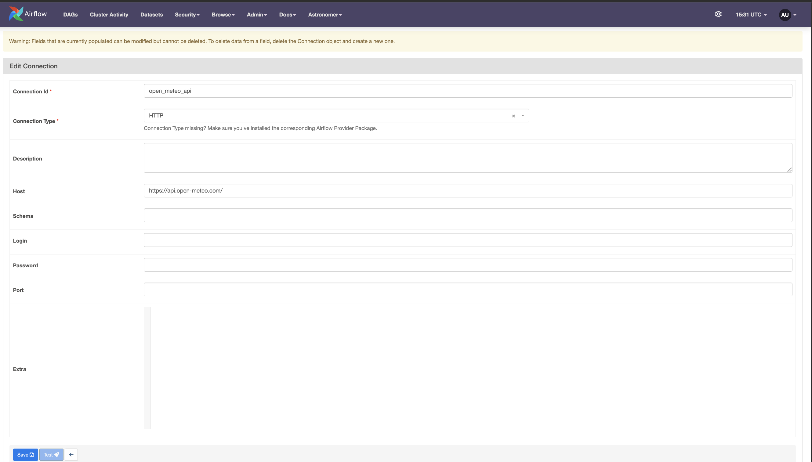
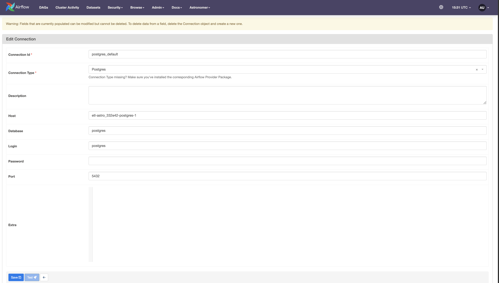
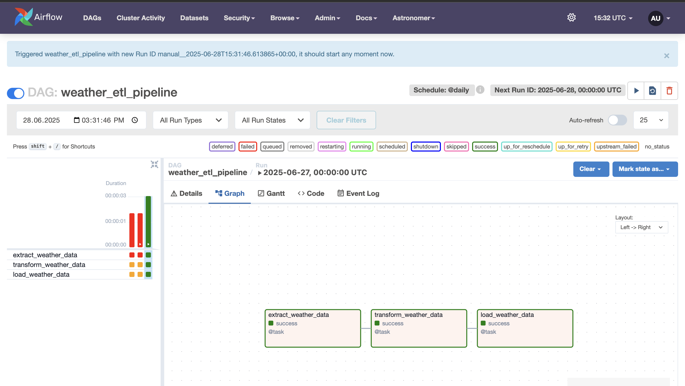
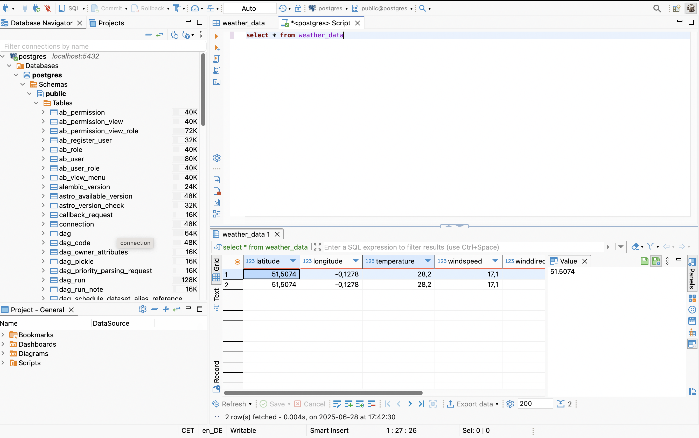

# 🌦️ Weather Data ETL Pipeline with Airflow, PostgreSQL & Docker

This project demonstrates a complete **ETL (Extract, Transform, Load)** pipeline using [Open-Meteo](https://open-meteo.com/) weather API. The pipeline is orchestrated using **Apache Airflow**, loads the data into **PostgreSQL (via Docker)**, and can be explored using **DBeaver**.

---

## 📌 Project Architecture

The following architecture illustrates the end-to-end workflow from data extraction to loading and orchestration:


---

## 🔗 API & Database Connections

Airflow uses built-in **Connections** for both the HTTP API and PostgreSQL database. Below are the screenshots of how those are configured:

- ✅ Open Meteo API Connection:
  
  

- ✅ PostgreSQL Connection:

  

- ✅ Full Connection List in Airflow UI:

  

---

## ⚙️ Tools Used

- **Airflow** for orchestration
- **PostgreSQL** for data storage (via Docker)
- **Open-Meteo API** for fetching weather data
- **DBeaver** for visualizing the data
- **Docker Compose** for environment setup

---

## 🗂️ Project Structure

├── dags/                   # Custom Airflow DAGs (ETL, examples)

│   ├── etlweather.py       # Weather ETL pipeline (this project)

│   └── exampledag.py       # Example DAG from Astronomer

├── tests/dags/             # Unit + integration tests

├── docker-compose.yml      # Postgres service

├── Dockerfile              # Custom Airflow image (extends astro‑runtime)

├── airflow_settings.yaml   # Pre‑seeded connections & variables

├── requirements.txt        # Extra Python deps (if any)

├── packages.txt            # OS packages to install into image

└── README.md               # ← you are here

---

## 🔄 DAG Workflow

The following DAG orchestrates the ETL process:

1. **Extract** weather data from Open-Meteo API

2. **Transform** relevant fields

3. **Load** the processed data into PostgreSQL



---

## 📊 Loaded Data View (in DBeaver)

You can connect DBeaver to the local PostgreSQL database (`localhost:5432`) to explore the data:



---

## 🧱 Weather Data Table Schema

Here’s the schema for the `weather_data` table in PostgreSQL:

```sql
CREATE TABLE IF NOT EXISTS weather_data (
    latitude FLOAT,
    longitude FLOAT,
    temperature FLOAT,
    windspeed FLOAT,
    winddirection FLOAT,
    weathercode INT,
    timestamp TIMESTAMP DEFAULT CURRENT_TIMESTAMP
);
```
## 🐳 Docker Setup

You can bring up the environment using Docker:
# Build and start services
astro dev start

Ensure Docker is running, and check logs if Airflow fails to start:

``` 
astro dev logs --webserver
astro dev logs --scheduler
```

## 🛠️ Airflow UI Access

Once started, access the Airflow UI at:

``` http://localhost:8080 ```

Use default credentials:
	
 •	Username: admin
	
 •	Password: admin (or whatever you’ve set)

## 🧪 Testing & Validation

•	You can use DBeaver or psql CLI to confirm that data is being inserted into the weather_data table.

•	Modify the DAG or add alerts if needed.

## ✅ Conclusion

This project showcases how to build a scalable, automated, and reproducible ETL pipeline using modern tools. You’ve set up data extraction, transformation, loading into a database, and built a robust Airflow DAG for scheduling.

## 📎 Appendix

•	Open-Meteo API: https://open-meteo.com/

•	Airflow Docs: https://airflow.apache.org/docs/

•	Astronomer CLI: https://docs.astronomer.io/astro/cli-install

•	DBeaver: https://dbeaver.io/

---

Let me know if you want this saved as a file or want to auto-generate it into a project!
